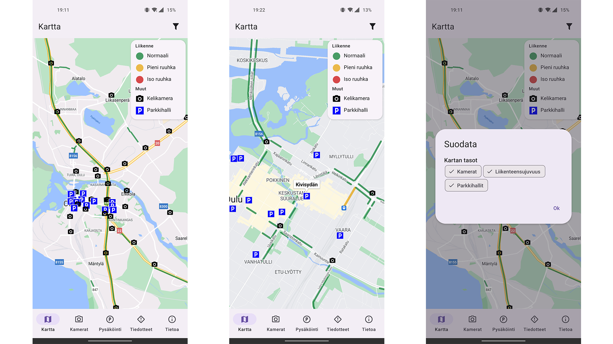
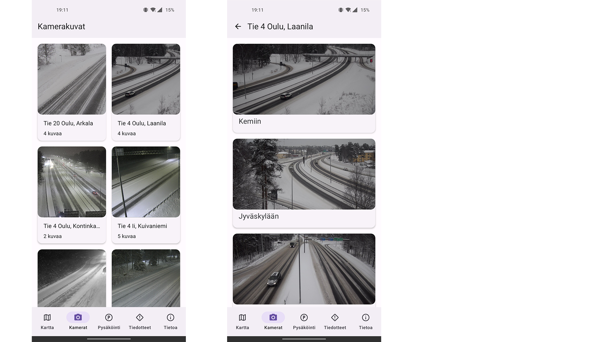
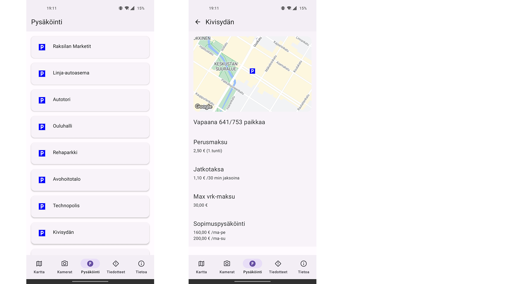
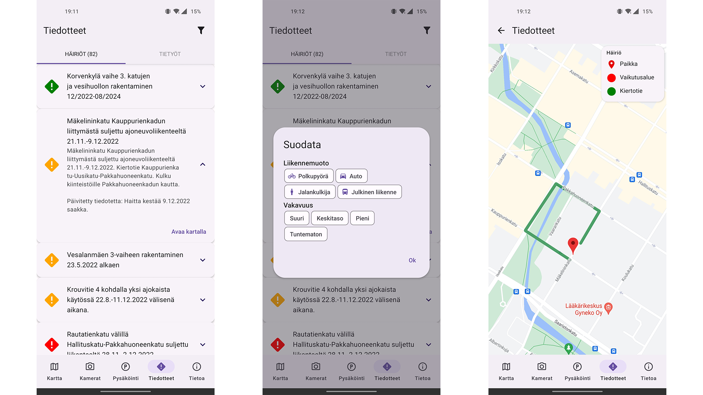
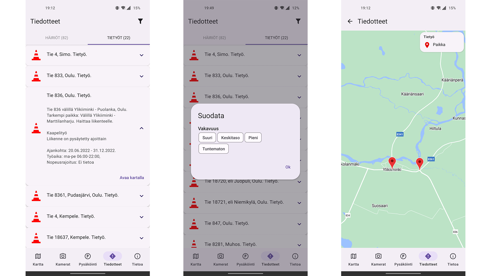
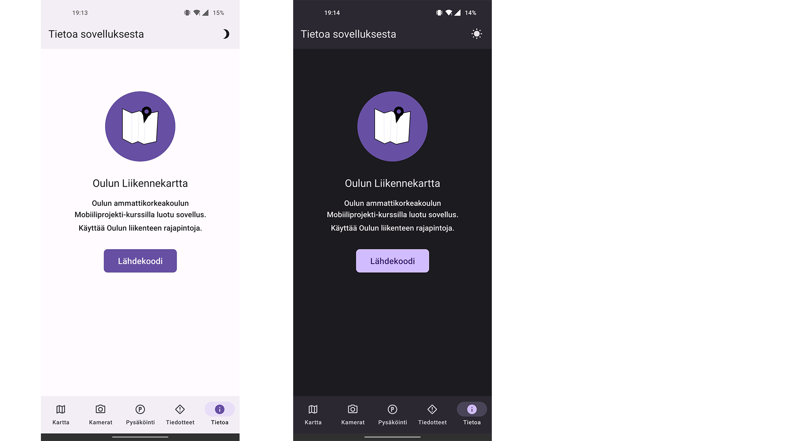
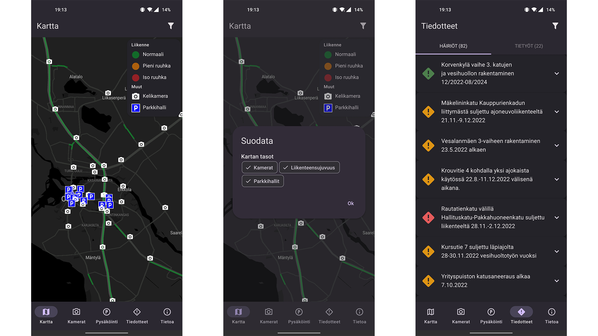

<h1 align="center">
 
  
 
Oulun Liikennekartta
</h1>

<h4>Tehty Oulun ammattikorkeakoulun Mobiiliprojekti-kurssilla. Käyttää Oulun liikenteen <a href="https://wp.oulunliikenne.fi/avoin-data/">rajapintoja</a>.</h4>

## Ruutukaappauksia

### Kartta

### Kelikamerat

### Pysäköinti

### Häiriöiedotteet

### Tietyöt

### Tietoa

### Tumma teema
